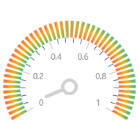

# Buzz mrScalder Lightyear 


## Contact information

Discord: mrScalder#2773  
github: mrScalder  
email: mrscalder@gmail.com

## Briefly About Myself:

Having started my career as a manual tester in a small company with minimum skills, I became junior automatization tester.
My keep interest about all IT and connected techlogies help me to solve new task in new systems and projects.

I think what in past 5 years web frontend have a big step forward and set as one of most intrest think in IT and I didn\'t see no one project wich was not frontend connected and that`s why I think what the any IT engeneer must to know how frontend works.

I believe, that my ability to learn and to gain new skills will lead me through this path of becoming a proficient Frontend Developer.

## Skills and Proficiency

* Java, Cucumber
* HTML5, CSS3
* JavaScript Basics
* Git, GitHub
* VS Code, IntelliJ IDEA

## Code example 

Random code from web

```
function solution(str){
  return str.split('').reverse().join('');  
}
```

## Courses

JavaScript Manual on learnjavascript.ru (in progress)  
RS Schools Course «JavaScript/Front-end. Stage 0» (in progress)  


## Languages

English - Pre-intermediate  
Russian - Native 

## Projects

opennlp example in Russian https://github.com/mrScalder/opennpl_examples